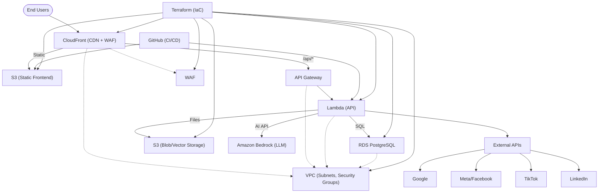

# Publicis AWS Infrastructure (Terraform)

## Overview
This project provisions a secure, scalable, and serverless infrastructure on AWS for the Publicis reporting platform. It supports a Next.js frontend (static hosting), a serverless backend (API), AI/LLM integration via Amazon Bedrock, PostgreSQL database, and secure file/vector storage.

---

## Architecture Summary
- **Frontend:** Next.js static site hosted on S3, served globally via CloudFront (with WAF)
- **Backend API:** AWS Lambda (Node.js) behind API Gateway, also served via CloudFront
- **AI/LLM:** Amazon Bedrock (fully managed, no container needed)
- **Database:** Amazon RDS PostgreSQL (private subnet, secure)
- **Storage:** S3 for app files, reports, and vector data
- **Security:** VPC, subnets, security groups, IAM, WAF
- **CI/CD:** GitHub Actions for automated frontend build & deploy

---

## Prerequisites
- AWS account with sufficient permissions
- [Terraform](https://www.terraform.io/downloads.html) v1.3+
- [Node.js](https://nodejs.org/) (for Next.js frontend)
- [AWS CLI](https://aws.amazon.com/cli/) (for local testing/deployment)
- GitHub repository for CI/CD

---

## Setup Instructions

### 1. Clone the Repository
```sh
git clone <your-repo-url>
cd <your-repo-directory>
```

### 2. Configure AWS Credentials
Ensure your AWS credentials are set (via `aws configure` or environment variables).

### 3. Initialize and Apply Terraform
```sh
terraform init
terraform apply
```
- Review the outputs for S3 bucket names, CloudFront URL, API Gateway URL, etc.
- Set sensitive variables (like `pg_admin_password`) as needed.

### 4. Set Up GitHub Actions for Frontend CI/CD
- In your GitHub repo, add a workflow (e.g., `.github/workflows/deploy-frontend.yml`):

```yaml
name: Deploy Next.js Frontend to S3
on:
  push:
    branches: [main]
jobs:
  build-and-deploy:
    runs-on: ubuntu-latest
    steps:
      - uses: actions/checkout@v3
      - uses: actions/setup-node@v3
        with:
          node-version: '18'
      - run: npm ci
      - run: npm run build && npm run export # or your Next.js build/export commands
      - uses: jakejarvis/s3-sync-action@master
        with:
          args: --acl public-read --delete
        env:
          AWS_S3_BUCKET: ${{ secrets.AWS_FRONTEND_BUCKET }} # Set this secret to your frontend S3 bucket output
          AWS_ACCESS_KEY_ID: ${{ secrets.AWS_ACCESS_KEY_ID }}
          AWS_SECRET_ACCESS_KEY: ${{ secrets.AWS_SECRET_ACCESS_KEY }}
          AWS_REGION: <your-region>
          SOURCE_DIR: "out" # or your build output dir
```
- Set the required secrets in your GitHub repo settings.

---

## User Process & Data Flow

1. **User** visits the CloudFront URL in their browser.
2. **CloudFront** routes requests:
   - Static assets (HTML, JS, CSS, images) → S3 frontend bucket
   - API requests (`/api/*`) → API Gateway → Lambda
3. **Lambda** (backend):
   - Handles API logic
   - Calls Amazon Bedrock for AI/LLM tasks
   - Reads/writes files and vectors to S3
   - Connects to RDS PostgreSQL for data
4. **External APIs** (Google, Meta, TikTok, LinkedIn) are called from Lambda as needed.
5. **WAF** protects CloudFront from common web attacks.

---

## Architecture Diagram



---

## Outputs & Access
- **CloudFront URL:** Main entry point for users (serves both frontend and backend)
- **API Gateway URL:** Direct API endpoint (for testing)
- **Frontend S3 Bucket:** For static site uploads (via CI/CD)
- **App/Vector S3 Buckets:** For backend file/vector storage
- **RDS Endpoint:** For database connections (private)

---

## Security & Best Practices
- All resources are provisioned in a VPC with subnets and security groups
- WAF protects CloudFront from common web attacks
- IAM roles restrict access to only what’s needed
- RDS is not publicly accessible
- S3 buckets are private except for static frontend (served via CloudFront)
- Use RDS Proxy for production Lambda-to-RDS connections

---

## Support / Contact
For questions or support, contact the DevOps team or open an issue in this repository.

---
